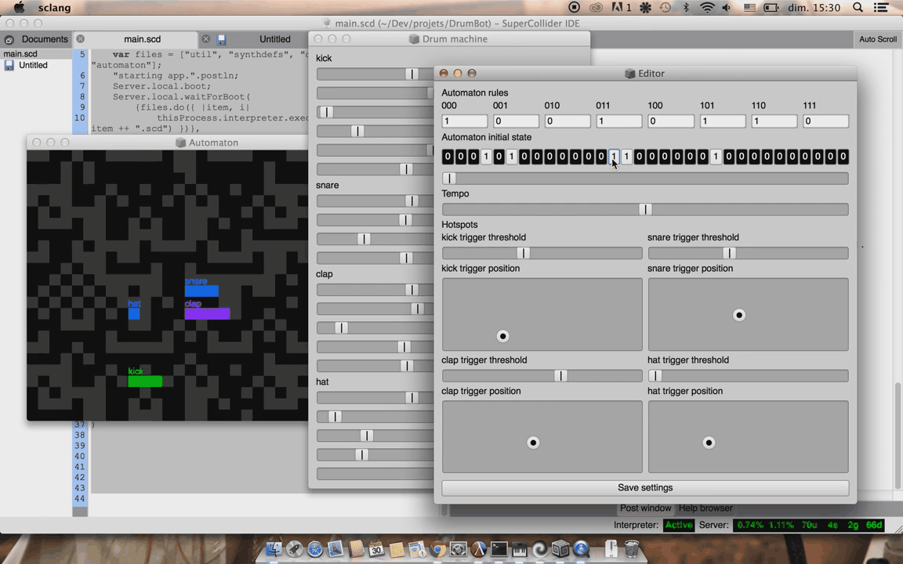

# DrumBot

A drum machine using a cellular automaton as its (experimental) sequencer, made with SuperCollider.
Note that the drum machine itself is fully synthesis based and can be used independently.

## Usage

Execute the code in `main.scd` to launch the app.
A dialog will pop up to let you open a settings file (such as `settings/rythm1`).
If you don't want to use one, just click "cancel" and the app will start with default / random settings.
